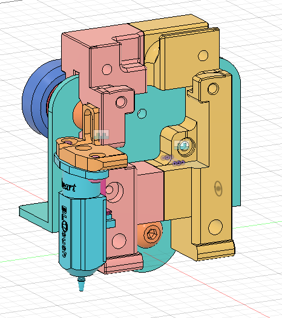
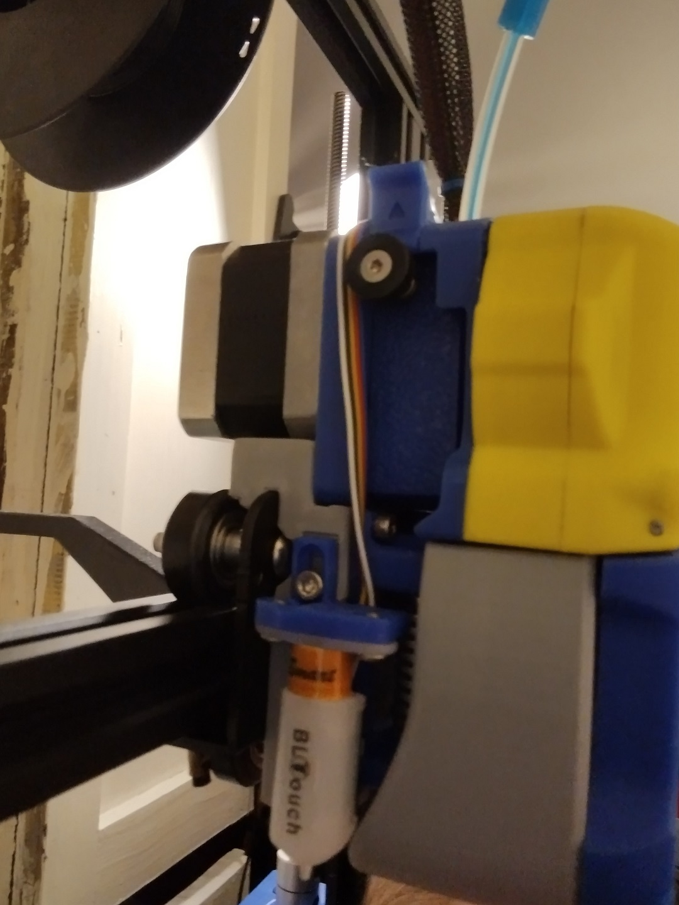
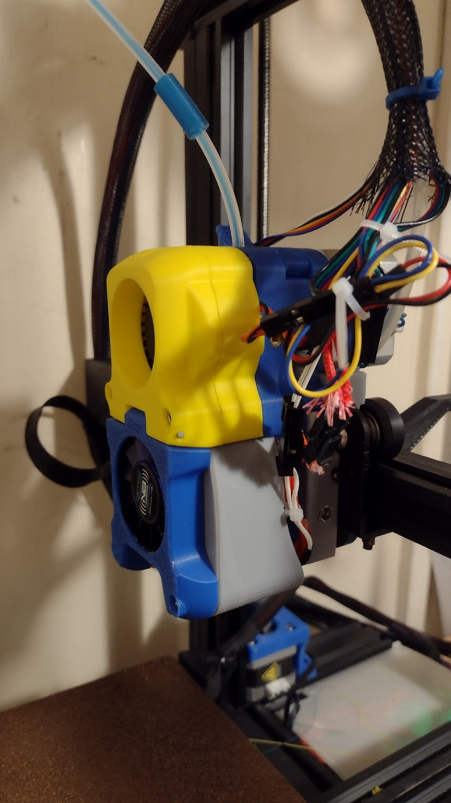

# Afterburner Carriage for Ender 3 v2

This is my effort to get an afterburner on my ender 3 v2, some of the other models modify the casing of the clockwork and i'd much rather have the full modularity the afterburner provides, so i can slot in different extruders and toolheads or even a dual/triple bowden adapter from the switchwire multi extrusion effort.
## Compatibility

This is known to fit a late 2020 production Ender v2, it might not fit older pros and vanilla ender 3s.

The afterburner carriage fits clockwork 1, AB-BN-30 and the stealthburner fan shroudand toolhead. It doesn not fit clockwork 2. A clockwork 2 compatible carriage will happen shortly. ERCF modified clockwork should fit

The Omron inductive probe does not fit, and is not compatible with the creality v-roller carriage. I use this with a BL-Touch. If you really want to use an omron style inductive probe you will likely need a linear rail setup, i suggest you consider converting your ender 3 into a switchwire.

## Printing

Use the settings at recommended by Voron

>The Voron Team has provided the following print guidelines for you to follow in order to have the best chance at success with your parts There are often questions about substituting materials or changing printing standards, but we recommend you follow these.
### PRINTING PROCESS
Fused Deposition Modeling (FDM)
### MATERIAL
ABS _I have tried this in PET-G on an unenclosed printer, but you will need to print the parts that get close to the heater block in ABS or ASA. Clockwork works in PET-G, and the yellow parts in my photo are PLA, and hasn't broken yet._
### LAYER HEIGHT
Recommended: 0.2mm
### EXTRUSION WIDTH
Recommended: Forced 0.4mm _this appears to apply to cura and assumes rectangular extrusion cross section, PrusaSlicer/SuperSlicer assumes round ends, and 0.45mm extrusion width results in ~0.40mm between extrusions._
### INFILL TYPE
Grid, Gyroid, Honeycomb, Triangle or Cubic
### INFILL PERCENTAGE
Recommended: 40%
### WALL COUNT
Recommended: 4
### SOLID TOP/BOTTOM LAYERS
Recommended: 5
## Disclaimer

This is provided entirely without warranty and it is entrely up to the user do assess the suitability of this for theor intended use.

## See Also
  - [Voron Afterburner](https://github.com/VoronDesign/Voron-Afterburner) this is the original toolhead this carriage mounts, you will need to print this to get a useable toolhead. Read thir documantation carefully for what parts to print.
  - [Stealthburner Beta](https://github.com/VoronDesign/Voron-Afterburner/tree/sb-beta) this is the original toolhead this carriage mounts, you will need to print this to get a useable toolhead. Read thir documantation carefully for what parts to print.
  - [AA-BN](https://github.com/VoronDesign/VoronUsers/tree/master/printer_mods/Badnoob/AB-BN) user mod fan duct and toolhead compatible with afterburner/clockwork, the basis for StealthBurner
  - [Enraged Rabbit](https://github.com/EtteGit/EnragedRabbitProject/blob/main/README.md) multimaterial project

## Gallery

