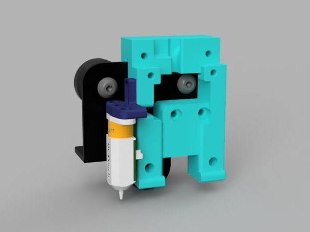
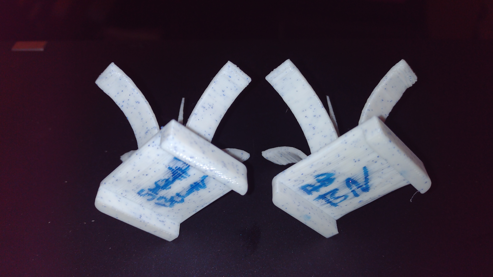
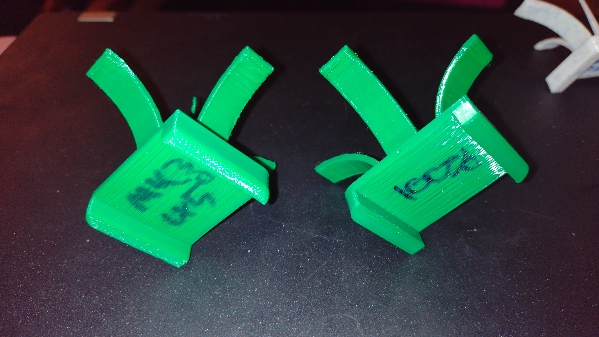

# Afterburner Carriage for Ender 3 v2

This is my effort to get an afterburner on my ender 3 v2, some of the other models modify the casing of the clockwork and i'd much rather have the full modularity the afterburner provides, so i can slot in different extruders and toolheads or even a dual/triple bowden adapter from the switchwire multi extrusion effort. This isn't really intended as an endpoint but a step between and Ender3 and building a Voron.
## User story

This was built as a way to try out afterburner before going all in on a Voron. Vorons have a pit of a reputation for being ABS machines, and as most models are designed to be enclosed they are **very** good at printing abs. The default 4020 fan afterburner is allegedly a bit feeble for printing ABS fast.

I had been using a [Hydra](https://www.thingiverse.com/thing:4062242) toolhead with dual 5015s on my ender 3 and had tried all the prusa toolheads on what started out as a self-sourced MK2 clone. The Hydra is **very** good but lacks good probe support, keeping the probe so far from the nozzle that it is not possible to probe a large stripe of the bed. The prusa toolheads weren't as good at overhangs and are very difficult to work on. The [afterBEARner](https://www.prusaprinters.org/prints/54545-afterbearner-the-prusa-bear-afterburner) carriage is worth investigting for use on linear rod printers and i have one on my mk2 frame.

My starting point for part cooling was [Greg191134's 5015 mod](https://github.com/Greg191134/Voron/tree/master/Afterburner%20Optimisation/5015%20fan%20mod) with the standard afterburner duct/hotend mount which worked ok, but I quickly printed [The Warbird](https://github.com/Greg191134/Voron/tree/master/Afterburner%20Optimisation/The%20Warbird) which does PLA a lot better, but I had some issues with the duct deforming. 

[Badnoob](https://github.com/VoronDesign/VoronUsers/tree/master/printer_mods/Badnoob/AB-BN)'s fan duct and toolhead was the part that really made this viable for me, and this was when i started ordering parts and [Stealthburner Beta](https://github.com/VoronDesign/Voron-Afterburner/tree/sb-beta) is incrediby impressive. I will update the carriage to support clockwork 2.

 ## Future

I am sourcing a switchwire which will start as an ender3 conversion so this will not be continuously developed. 
## Changes

- 4 made a clockwork 2 comaptible version.

- 3 Shared my AB-BN toolhead mod for creality hotends. It only works with the AB-BN-30 fan shroud, not afterburner or stealthburner. It's better with a v6 type nozzle and slightly longer screws on the hotend, and i'm using a bimetallic heatbreak. I don't recommend anyone go out and buy a slice heatbreak, if you want an upgrade buy a voron supported hotend. I get really nice results with my v6s, but I'm using this on one printer as I;m a cheapskate. May have jams if you use a 12v or silent fan. Works great with stock 24v creality fan. 
- 2 Made a mount that sits on the right hand side of the carriage close to the stock x position. Hopefully the nozzle will require less X offset and can probe more of the bed due to extra travel available of the carriage beyond the right side of the bed.
- 1 Initial commit

## Compatibility

This is known to fit a late 2020 production Ender v2, it might not fit older pros and vanilla ender 3s.

The afterburner carriage fits clockwork 1, AB-BN-30 and the stealthburner fan shroudand toolhead. It doesn not fit clockwork 2. ~~A clockwork 2 compatible carriage will happen shortly.~~ ERCF modified clockwork should fit. A modified version that should fit Clockwork 2 is availabe in the CW2 folder.

The Omron inductive probe does not fit, and is not compatible with the creality v-roller carriage. I use this with a BL-Touch. If you really want to use an omron style inductive probe you will likely need a linear rail setup, i suggest you consider converting your ender 3 into a switchwire.

Some alterations to your firmware configuration may be required. I will not provide support for Marlin configs, you're on you own there. I'm a klipper user and highly recommend it if you change your hardware often as configuration is all done in text files and you just restart the printer after making changes.

## Duct/mount for creality hotend

I have a fancy and expensive bimetallic heatbreak for the creality hotend and wanted to continue using it. It cost as much as buying an entire E3D V6 which has a better thermistors and heater, and works just as well. I get best performance out of a V6 with a titanium heatbreak, although I think i'm using a clone heatsink. I have a clone copper heater block on one of my V6s, i'm not sure it makes any difference. 

I'm using E3D nozzles with my creality hotend which required some longer screws between the heater block and heatsink. These should be stainless steel if possible. Screw the nozzle almost all the way into the heater block, with maybe 1mm between the hex flange of the nozzle and heater block and then screw the heatbreak in, it will sit prouder than usual but it works. I have not tested this toolhead with mk8/creality style nozzles, but the cad suggests it will fit. The overall lenght of the hotend doesn't change appreciably when using E3D style nozzles, they are close to the same lenght overall as the creality ones but have a longer threaded section and shorter length after the flange. They provide slightly better filament heating and much better ironing performance.

Do not use a "silent" fan with the creality hotend, it needs the flow of a 24v high flow cooling fan, the stock creality one is ok, you don't need to buy an expensive one, but if you have a noctua 4010 or a cheap silent fan it will probably cause jams, certainly it did for me.

## Versions
### RightHandMount
I reworked my original to mount near where the original hotend mounts, it should make for easier use without custom firmware and allows more ofthe bed to be probed. You may need to turn around the bolt on the lower v-roller so the head faces the gantry, this will allow more X travel.

[RightHandMount](https://github.com/strayr/voron-afterburner-ender3/tree/main/RightHandMount)

### OriginalMount

This is my [original](https://github.com/strayr/voron-afterburner-ender3/tree/main/OriginalMount) version, centered on the carriage plate, it's more stable but if you use a probe it can't reach as much of the bed. It works well but I prefer the right hand mount. It may require custom firmware.

## Printing

Use the settings at recommended by Voron

>The Voron Team has provided the following print guidelines for you to follow in order to have the best chance at success with your parts There are often questions about substituting materials or changing printing standards, but we recommend you follow these.
### PRINTING PROCESS
Fused Deposition Modeling (FDM)
### MATERIAL
ABS _I have tried this in PET-G on an unenclosed printer, but you will need to print the parts that get close to the heater block in ABS or ASA. Clockwork works in PET-G, and the yellow parts in my photo are PLA, and hasn't broken yet._
### LAYER HEIGHT
Recommended: 0.2mm
### EXTRUSION WIDTH
Recommended: Forced 0.4mm _this appears to apply to cura and assumes rectangular extrusion cross section, PrusaSlicer/SuperSlicer assumes round ends, and 0.45mm extrusion width results in ~0.40mm between extrusions._
### INFILL TYPE
Grid, Gyroid, Honeycomb, Triangle or Cubic
### INFILL PERCENTAGE
Recommended: 40%
### WALL COUNT
Recommended: 4
### SOLID TOP/BOTTOM LAYERS
Recommended: 5
## Disclaimer

This is provided entirely without warranty and it is entrely up to the user do assess the suitability of this for the intended use.

## License

This is provided under a [GNU GPL 3.0 licence](./LICENSE). 

Do not publish under another license. You must provide your CAD source for any changes. STL is not source. We have such an amazing array of printers available becasue of the open source nature of the [RepRap](https://reprap.org) project and [OpenHardware](https://www.oshwa.org). Both the [Creality Ender 3](https://github.com/Creality3DPrinting/Ender-3) and the entire [Voron project](https://github.com/VoronDesign) are open source.

Give Back. 

## Contact

Please raise an issue on my github if you have specific issues. I cannot provide support for all your problems, but if my designs don't work for you I want to know and may attempt to improve them. This is entirely a hobby and motivated out of self interest.

## See Also
  - [Voron Afterburner](https://github.com/VoronDesign/Voron-Afterburner) this is the original toolhead this carriage mounts, you will need to print this to get a useable toolhead. Read thir documantation carefully for what parts to print.
  - [Stealthburner Beta](https://github.com/VoronDesign/Voron-Afterburner/tree/sb-beta) this is the original toolhead this carriage mounts, you will need to print this to get a useable toolhead. Read thir documantation carefully for what parts to print.
  - [AB-BN](https://github.com/VoronDesign/VoronUsers/tree/master/printer_mods/Badnoob/AB-BN) user mod fan duct and toolhead compatible with afterburner/clockwork, the basis for StealthBurner.
  - [Greg191134](https://github.com/Greg191134/Voron/tree/master/Afterburner%20Optimisation) Alternate 5015 fan housing and Warbird Duct
  - [Enraged Rabbit](https://github.com/EtteGit/EnragedRabbitProject/blob/main/README.md) multimaterial project

## Gallery
Afterburner duct, clockwork extruder and Greg191134's 5015 fan mod

Stealthburner (left) and AB-BN-30 (right) with Ziro PLA

Prusa (left) and Hydra (right) with 3dTomorrow PLA

